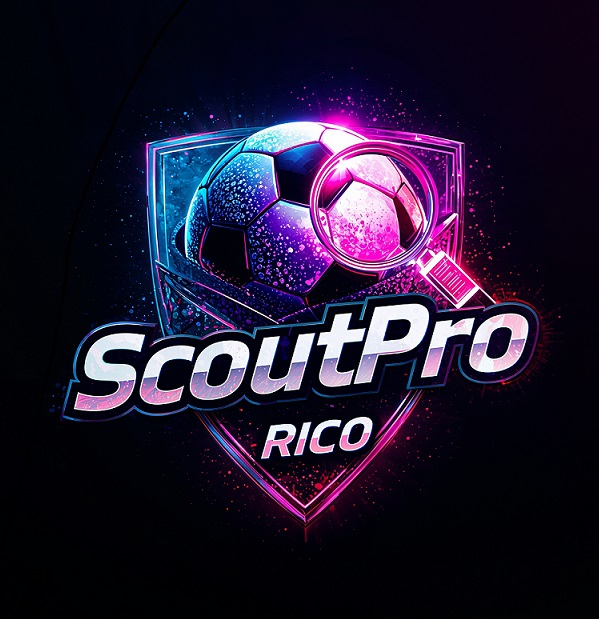
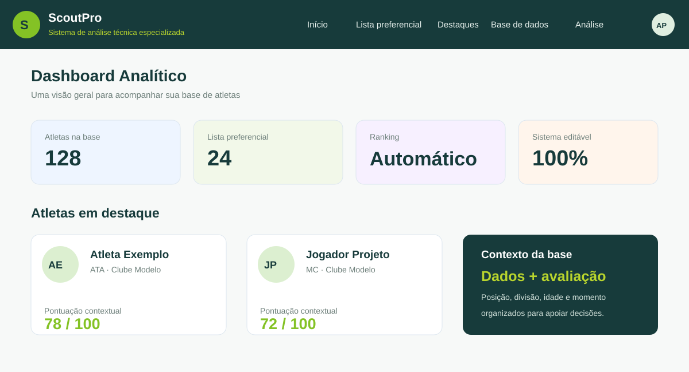
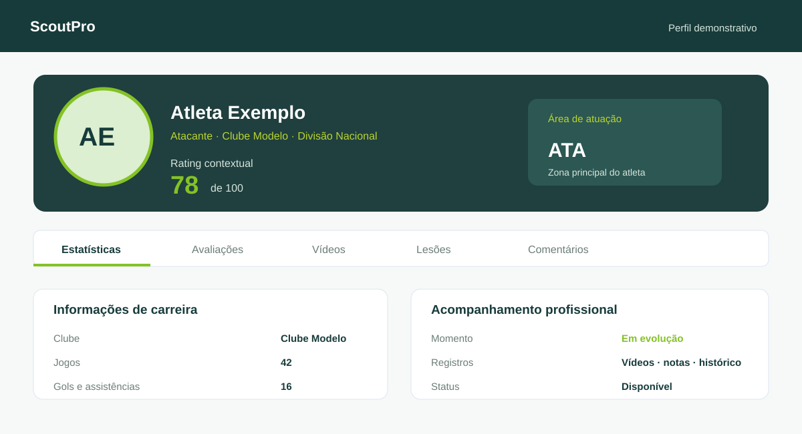
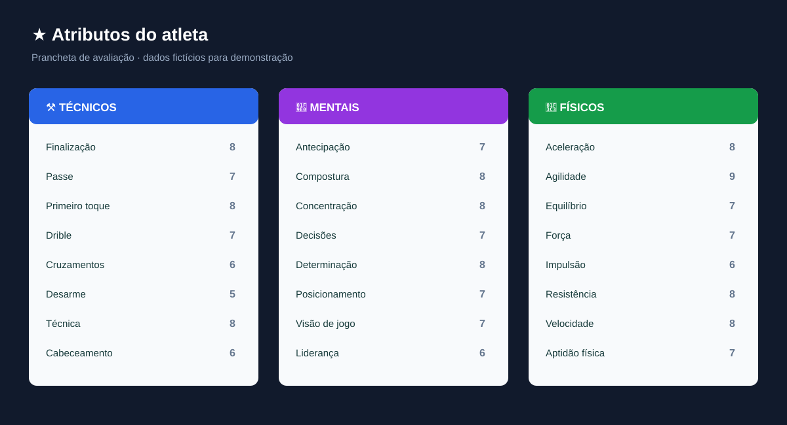

  
  
<strong>ScoutPro</strong>

  

    <strong>Plataforma de scouting e análise de atletas</strong> 
    Avaliação técnica, dados de desempenho e contexto esportivo 
    para apoiar decisões profissionais no futebol
  

O projeto aqui apresentado é referente ao **ScoutPro**, uma plataforma em desenvolvimento para análise, avaliação e acompanhamento de atletas de futebol.

Criado inicialmente a partir de uma necessidade esportiva de um clube, o sistema está sendo estruturado para evoluir para um serviço acessível a clubes, analistas, profissionais do futebol, empresários e demais usuários que precisam organizar informações e tomar decisões com mais contexto.

## Uma avaliação inspirada na clareza dos games, com metodologia própria

O ScoutPro aproveita a forma visual e intuitiva como os jogos de gerenciamento esportivo apresentam atributos, posições e ratings. A metodologia de avaliação, porém, é própria e funciona como uma prancheta digital de scouting.

Cada atleta pode ser avaliado em uma escala de **0 a 10** em diferentes dimensões, como atributos técnicos, físicos, mentais e específicos da posição. Finalização, passe, agilidade, força, impulsão, concentração e outras características ajudam a formar uma visão ampla do jogador.

O rating final não depende apenas de uma nota isolada. Ele considera posição, idade, divisão, clube, nível competitivo, estatísticas, minutagem, conquistas, histórico, momento atual, tendência de desempenho e estágio da carreira. Assim, a avaliação procura respeitar o contexto real do atleta, distinguindo potencial, experiência, produção atual e declínio físico.

Na plataforma, o perfil do atleta organiza informações de carreira, posição, idade, clube, divisão, jogos, gols, assistências, vídeos, avaliações, lesões e comentários em módulos de acompanhamento profissional. A imagem acima é uma visualização ilustrativa, com dados fictícios.

## O que a plataforma reúne

- busca de atletas e identificação de candidatos;
- coleta de informações e evidências disponíveis na web;
- perfil factual com dados pessoais, clube, posição, divisão e histórico;
- estatísticas por temporada, jogos, minutos, gols e assistências;
- avaliações técnicas, físicas, mentais e de goleiros;
- atributos ponderados conforme a posição do atleta;
- nota gerada por inteligência artificial, avaliação humana e pontuação híbrida;
- ranking, filtros, prioridades e acompanhamento de disponibilidade;
- histórico de clubes, conquistas, contratos e valor de mercado;
- registros de lesões, vídeos, comentários e anotações profissionais;
- visão de evolução, pico de carreira e tendência de desempenho.

## Uma base de dados viva para o futebol

O objetivo é que cada profissional possa manter sua própria base de atletas, registrar avaliações, enriquecer perfis e acompanhar mudanças ao longo do tempo. Em uma evolução futura, atletas e empresários também poderão incluir e administrar seus próprios perfis, ampliando a base de conhecimento da plataforma.

O ScoutPro foi pensado para transformar dados dispersos, observações técnicas e contexto esportivo em uma visão organizada do atleta. A ferramenta apoia o trabalho profissional, sem substituir o julgamento do analista.

## Estágio do projeto

O ScoutPro já está online e possui uma versão funcional. O produto segue em evolução para oferecer contas individuais e um ambiente de análise que possa ser contratado por diferentes perfis do ecossistema do futebol.

O projeto é desenvolvido pela **Rico Soluções Inteligentes**.

> ScoutPro. Dados, contexto e avaliação profissional para entender melhor o atleta.
